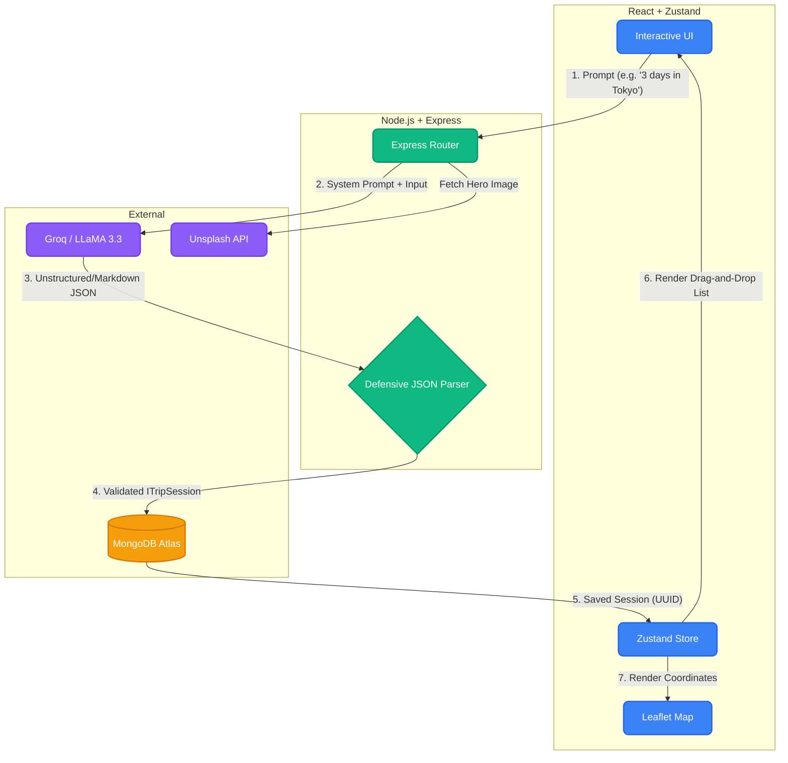
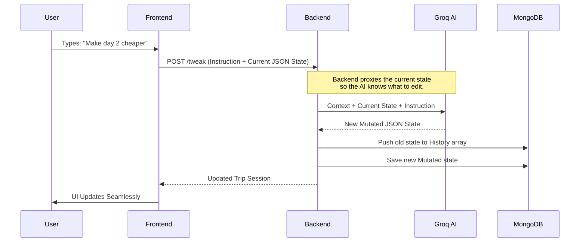

# 🌍 AI Trip Planner


A production-ready, full-stack MERN application built for the **Frontend Internship Assignment**. It transforms free-form natural language into a highly structured, interactive, and shareable travel itinerary using Large Language Models (LLMs).

---

## 🏗️ System Architecture

The application is built on a defensive architecture designed to handle unpredictable AI outputs gracefully. The frontend never talks directly to the AI—everything is proxied through a Node.js backend that sanitizes and validates the data.



---

## ✨ Core Features

- **Defensive AI Parsing:** LLMs often hallucinate markdown blocks (e.g., ` ```json `). A custom regex parser safely extracts and parses JSON before it ever hits the database.
- **Interactive Builder:** Uses `@dnd-kit` for real-time drag-and-drop, allowing users to reorganize AI-generated stops seamlessly.
- **Session Persistence & Routing (Stretch Goal):** All trips are saved to MongoDB. A unique URL (e.g., `/trip/abc-123`) allows users to return to or share their specific itinerary.
- **Stale Response Mitigation:** Uses `AbortController` on network requests so newer generations automatically cancel older pending requests, avoiding state race conditions.

---

## 🔄 The "Tweak" Loop (Stretch Goal)

Rather than forcing the user to regenerate an entire trip if they don't like one part of it, the app features a "Tweak Panel". 



---

## 🚀 Setup Instructions

### Prerequisites
- Node.js (v18+)
- MongoDB (running locally or via Atlas)

### 1. Backend Setup
```bash
cd backend
npm install
copy .env.example .env
```
Fill out the `.env` file with your `GROQ_API_KEY` (free from groq.com) and `UNSPLASH_ACCESS_KEY` (free from unsplash.com).

Run the backend:
```bash
npm run dev
```

### 2. Frontend Setup
Open a new terminal.
```bash
cd frontend
npm install
npm run dev
```
Navigate to `http://localhost:5173` in your browser.

---

## 🤖 AI Usage Note
AI tools (DeepMind Agents / GitHub Copilot) were used to bootstrap the Tailwind v4 styling, assist in formatting standard boilerplate (like configuring Vite/PostCSS), and provide suggestions for complex generic algorithms (like the defensive JSON regex parser). The core architectural decisions (Zustand over Context, MongoDB schema design, Groq integration, and Error Boundaries) were carefully planned out to meet the strict requirements of the assignment. I am fully prepared to explain and walk through every line of code!

## ⚠️ Known Limitations
- The Unsplash API has a rate limit of 50 requests per hour for free tiers. If this limit is hit, the hero image will silently fallback to a default image.
- Since the AI tries to find real places and approximate coordinates, obscure places may have slightly inaccurate geocoordinates on the Leaflet map.

## ⏱️ Time Spent
Approximately ~6 to 7 hours of active architecture planning, development, and debugging across the frontend and backend.
